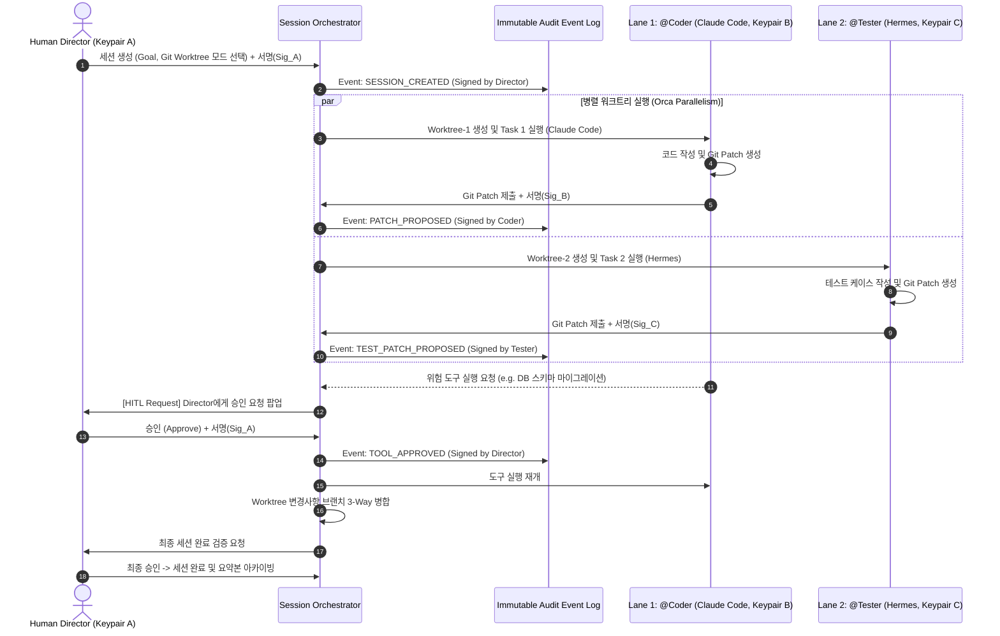
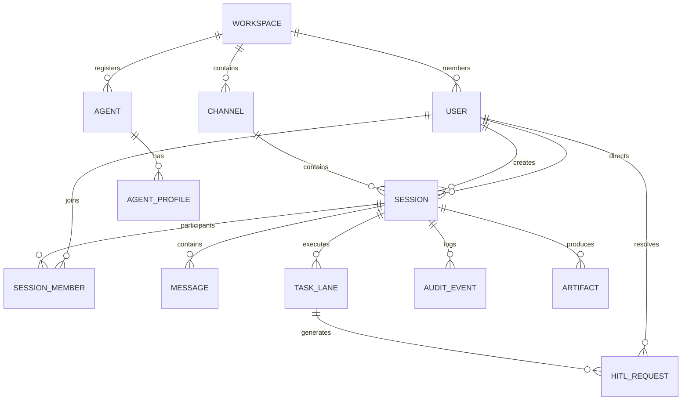
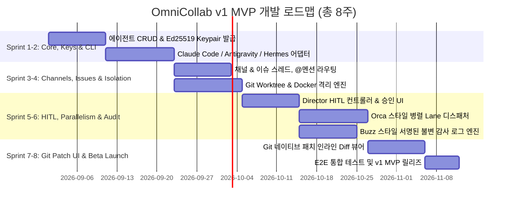

# [PRD] Multi-Agent Collaboration Messaging Service
**프로젝트명 (가칭)**: **OmniCollab** (Agent-to-Agent & Human Collaborative Workspace)  
**버전**: v1.2.0 (Block/Buzz Architectural Strengths Integrated)  
**작성일**: 2026-09-02  
**상태**: Approved Architecture / Detailed Design  

---

## 1. 개요 및 목적 (Executive Summary & Objectives)

### 1.1 배경
단일 LLM 에이전트는 복잡한 워크플로우를 처리하는 과정에서 컨텍스트 윈도우 한계, 역할 집중도 저하, 환각 및 병목 현상이 발생합니다. 최신 AI 협업 생태계는 각각 전문화된 프롬프트, 모델, 도구를 가진 **다중 에이전트(Multi-Agent)**들이 팀을 이루어 작업을 분할하고 상호 검토하는 방향으로 발전하고 있습니다.

특히, **[Multica](https://github.com/multica-ai/multica)**의 이슈 트래커 기반 에이전트 협업 모델, **[Orca](https://github.com/microsoft/orca)**의 분산 병렬 작업 실행, 그리고 **[Block Buzz](https://github.com/block/buzz)**의 암호화 신원 기반 감사 로그(Audit Trail) 및 Git 네이티브 채널 워크스페이스를 유기적으로 결합하여 엔터프라이즈 환경에서도 안전하고 신뢰할 수 있는 인간-에이전트 협업 플랫폼을 구축합니다.

### 1.2 핵심 목적 (Objectives)
1. **Agent 간 협업 메시징 플랫폼**: 복수 개의 AI 에이전트를 등록하고 역할을 부여하여, 공통 컨텍스트를 공유하며 협업하는 메시징 워크스페이스 제공.
2. **외부 CLI 런타임 기본 탑재 (Core CLI Runtimes)**: v1부터 **Claude Code**, **Antigravity CLI**, **Hermes**를 기본 런타임으로 지원하고, 에이전트별 멀티 프로파일(Multi-profile) 설정 제공.
3. **채널 & 이슈 기반 협업 구조 (Buzz + Multica Style)**: 도메인/프로젝트별 **채널(Channel)** 내에서 작업 단위인 **이슈(세션)**를 생성하고, 인간과 에이전트가 `@AgentName` 멘션 및 실시간 스트리밍 대화를 통해 작업 수행.
4. **Director 중심의 Human-in-the-Loop (HITL)**: 다중 참여자 환경에서 한 명의 인간을 **Director(책임자)**로 지정하여 의사결정·도구 승인·질문 답변을 일원화하고 통제력 확보.
5. **암호화 서명 신원 & 불변 감사 로그 (Buzz-inspired Cryptographic Audit Log)**: 모든 에이전트와 사용자에게 Keypair를 부여하고, 메시지·도구 호출·HITL 승인·Git 이벤트를 서명된 불변 이벤트 로그(Append-only Hash-chained Log)로 영구 기록하여 완벽한 감사 추적성과 타임트래블 리플레이 지원.
6. **듀얼 격리 레인 (Git Worktree vs Container Sandbox)**: 세션 생성 시 목적(코드 작업 vs 일반 지식/보안 작업)에 따라 격리 방식을 선택하여 안전한 병렬 실행 지원.
7. **Git 네이티브 패치 및 인라인 리뷰 (Git-Native Collaboration)**: 에이전트의 코드 변경사항을 Git Patch/Commit 이벤트로 다루며 실시간 Diff 인라인 리뷰 및 충돌 해결 지원.
8. **안전한 에이전트 풀 통제 (Strict Registered Pool)**: 세션 진행 중 에이전트 동적 생성(채용)을 금지하고, 사전 등록된 에이전트 풀 내에서만 위임하여 비용 및 무한 루프 방지.
9. **설정 가능한 컨텍스트 요약 (Configurable Context Limits)**: 세션 완료 후 다음 세션으로 컨텍스트를 넘길 때 토큰 상한을 사용자가 직접 설정하여 캐시 비용 및 문맥 최적화.
10. **Orca 스타일의 병렬 실행 (Parallel Task Execution)**: 독립된 서브태스크를 다중 에이전트 레인(Lane)으로 비동기 동시 실행하여 작업 효율 극대화.

---

## 2. 타겟 페르소나 및 핵심 유스케이스 (Target Personas & Use Cases)

| 페르소나 | 주요 니즈 | 대표 시나리오 |
| :--- | :--- | :--- |
| **엔지니어링 리드 / Director** | 복잡한 기능 개발 시 아키텍처 설계, 구현, 테스트, 코드 리뷰를 분업화하고 위험 도구 실행 통제 및 암호화 감사 기록 확보 | `#payment-channel`에서 세션 Director로 참여 → `@Planner`(Antigravity)가 작업 분할 → `@Coder`(Claude Code)와 `@Tester`(Hermes)가 Git Worktree에서 병렬 구현 → Git Patch 생성 → Director 승인(서명) 후 Merge |
| **보안 / 컴플라이언스 책임자** | AI 에이전트의 도구 실행 내역 및 파일 변경에 대한 위변조 불가능한 감사 로그 필요 | 에이전트의 모든 Bash 명령어, 외부 API 호출, 파일 수정 내역이 에이전트 전용 Ed25519 서명과 함께 불변 이벤트 로그에 기록되어 감사 보고서 자동 생성 |
| **프로덕트 매니저 / 기획자** | 시장 조사, 경쟁사 분석, PRD 작성 등의 리서치 및 문서화 자동화 | `#product-strategy` 채널에서 Container Sandbox 세션 생성 → 3개 리서치 에이전트가 병렬 웹 조사 → Director에게 중간 질문(HITL) → `@Writer`가 최종 문서 취합 |
| **DevOps / SRE** | 인프라 진단, 장애 트리아지, 마이그레이션 스크립트 작성 및 검증 | 에이전트가 명령어 실행 전 Director에게 `Tool Approval` 요청 → Director가 Diff 및 영향도 확인 후 승인 |

---

## 3. 핵심 아키텍처 결정 사항 (Key Architectural Decisions)

| # | 항목 | 결정 내용 | 상세 사유 및 구현 방향 (Multica / Buzz / Orca 접목) |
| :--- | :--- | :--- | :--- |
| **1** | **HITL 대상** | **Human Director 단일 지정** | 다중 참여자 간 승인 충돌을 방지하기 위해 세션 생성 시 1인의 `Director`를 지정. 모든 질문/승인 요청은 Director에게 전달되며, 부재 시 위임(Delegation) 가능 |
| **2** | **에이전트 신원 & 감사성** | **Buzz 스타일 암호화 Keypair & 서명 이벤트 로그** | 모든 에이전트와 인간 사용자에게 Ed25519 Keypair를 발급. 메시지, 도구 실행, HITL 승인 이벤트를 서명 후 해시 체인 로그로 저장하여 부인 방지 및 감사 추적 보장 |
| **3** | **워크스페이스 구조** | **채널(Channel) > 이슈/세션(Session) 2단계 구조** | Buzz의 채널 중심 워크스페이스를 채택하여 도메인별 컨텍스트를 분리하고, 각 채널 안에서 Multica 스타일의 이슈/세션 스레드를 운영 |
| **4** | **Lane 격리 방식** | **Git Worktree & Container 듀얼 지원 (세션별 선택)** | - **Git Worktree**: 코드 작업 위주, 경량화 및 빠른 브랜칭/머지 (Orca 방식)<br>- **Container Sandbox**: 문서·리서치·비코드 및 고도의 보안 격리 필요 시 선택 |
| **5** | **동적 에이전트 생성** | **세션 중 생성 불허 (Strict Pool Only)** | 미인가 도구 호출, 비용 폭증, 무한 복제 루프를 차단하기 위해 사용자가 사전 등록한 에이전트 풀 내에서만 위임 허용 |
| **6** | **세션 요약 길이 상한** | **설정에서 사용자 정의 가능 (Configurable)** | 기본값 2,000 토큰 (500~8,000 토큰 범위 조정 가능). 아티팩트 링크와 핵심 Findings 위주로 압축하여 캐시 비용 최적화 |
| **7** | **런타임 및 모델 설정** | **CLI 런타임 기반 + 멀티 프로파일 지원** | 에이전트별로 복수의 프로파일(예: Claude Code - Sonnet 3.7 / Antigravity - Gemini 2.5 / Hermes - Llama 3.3)을 등록하고 상황별 스위칭 지원 |
| **8** | **초기 지원 CLI** | **v1부터 Claude Code, Antigravity, Hermes 3종 탑재** | Multica 데몬 아키텍처를 도입하여 로컬/원격 CLI 데몬 어댑터를 통해 PTY/Stdio/JSON-RPC 스트리밍을 기본 제공 |
| **9** | **코드 협업 방식** | **Git 네이티브 패치 및 인라인 Diff 리뷰** | 단순 텍스트 코드 블록을 넘어 Git Commit/Patch 이벤트 스트림을 지원하여 이슈 내 인라인 코드 리뷰 및 브랜치 자동 병합 |

---

## 4. 시스템 아키텍처 (System Architecture)

### 4.1 상위 아키텍처 다이어그램 (High-Level Architecture)

```mermaid
flowchart TB
    subgraph UI_Layer [Frontend: Next.js 15 / React 19]
        ChannelNav[채널 및 워크스페이스 탐색기]
        Dashboard[이슈/세션 대시보드 - Kanban/List]
        AgentConfig[에이전트 & 멀티 프로파일 관리]
        ChatRoom[이슈 협업 채팅 & 실시간 PTY 스트림]
        HITLModal[Director 전용 HITL 승인/질문 패널]
        GitDiffViewer[Git 네이티브 패치 & 인라인 리뷰어]
        DAGViewer[React Flow 기반 병렬 Lane 뷰어]
    end

    subgraph Gateway_Layer [API & Realtime Gateway]
        REST_API[REST API Gateway - Channels / Sessions / Agents / HITL]
        WS_Server[WebSocket / SSE Pub-Sub Bus]
        EventSigner[Event Verification & Signature Engine]
    end

    subgraph Core_Orchestrator [Collab Orchestration Engine]
        ChannelManager[Channel & Permission Scope Manager]
        SessionManager[Session & Goal Lifecycle Manager]
        MentionRouter[Mention & Agent Dispatcher]
        HITLController[Director HITL Controller & State Lock]
        ParallelEngine[Orca Parallel Lane & Task Coordinator]
        ContextManager[Shared Blackboard & Summary Compressor]
        AuditEngine[Buzz-style Tamper-Evident Audit Logger]
    end

    subgraph Runtime_Adapter_Layer [CLI Runtime Daemon & Adapters]
        ClaudeAdapter[Claude Code CLI Adapter]
        AntigravityAdapter[Antigravity CLI/SDK Adapter]
        HermesAdapter[Hermes CLI Adapter]
        NativeAdapter[Native LLM API Fallback]
    end

    subgraph Isolation_Layer [Dual Isolation Infrastructure]
        WorktreeMgr[Git Worktree Manager (Code Lanes)]
        ContainerMgr[Docker / Sandbox Manager (Secure Lanes)]
    end

    subgraph Storage_Layer [Persistence & Event Sourcing]
        PostgreSQL[(PostgreSQL 16 + pgvector)]
        EventStore[(Immutable Event Sourced Log - Hash Chained)]
        Redis[(Redis: Pub/Sub, Locks, BullMQ)]
        ArtifactStore[(Git Repositories & Artifact Storage)]
    end

    UI_Layer <--> Gateway_Layer
    Gateway_Layer <--> Core_Orchestrator
    Core_Orchestrator <--> Runtime_Adapter_Layer
    Core_Orchestrator <--> Isolation_Layer
    Core_Orchestrator <--> Storage_Layer
    Runtime_Adapter_Layer <--> Isolation_Layer
```

### 4.2 Director 중심의 HITL, 암호화 감사 서명 및 병렬 실행 시퀀스



---

## 5. 상세 기능 요구사항 (Detailed Functional Requirements)

### 5.1 [FR-1] 에이전트 등록, 멀티 프로파일 & 암호화 신원 (Agent Registry & Identity)

| 기능 ID | 기능명 | 상세 내용 | 우선순위 |
| :--- | :--- | :--- | :--- |
| **FR-1.1** | 에이전트 기본 프로필 | 이름, 핸들(`@handle`), 아바타, 한 줄 역할 설명(Role Summary), 태그 설정 | **P0** |
| **FR-1.2** | **암호화 신원 (Cryptographic Identity)** | 에이전트 생성 시 고유 Ed25519 Keypair 발급. 에이전트가 발행하는 모든 메시지, 도구 실행, Git 커밋에 디지털 서명 첨부 (Buzz 메커니즘 호환) | **P0** |
| **FR-1.3** | **멀티 프로파일(Multi-Profile) 구성** | 하나의 에이전트 핸들에 복수의 런타임/모델 프로파일 등록 및 기본(Default) 프로파일 지정:<br>- **Profile A**: CLI = `Claude Code`, Model = `claude-3-7-sonnet`<br>- **Profile B**: CLI = `Antigravity`, Model = `gemini-2.5-pro`<br>- **Profile C**: CLI = `Hermes`, Model = `Llama-3.3-70B` | **P0** |
| **FR-1.4** | System Instruction 템플릿 | 페르소나 및 행동 지침 정의. 동적 변수(`{{session_goal}}`, `{{director_name}}`, `{{channel_name}}`, `{{shared_context}}`) 지원 | **P0** |
| **FR-1.5** | **세션 중 동적 생성 불허** | 세션 실행 도중 에이전트가 새로운 에이전트를 임의로 생성/호출하는 행위를 엄격히 차단. 작업 위임은 등록된 에이전트 풀 내에서만 허용 | **P0** |
| **FR-1.6** | 에이전트 권한 스코프 (Permission Scoping) | 에이전트별 허용 채널, 접근 가능한 Git 리포지토리, 실행 가능 툴 목록을 화이트리스트로 제한 | **P1** |

---

### 5.2 [FR-2] 채널, 세션 & Goal 및 격리/컨텍스트 설정 (Channel & Session Definition)

| 기능 ID | 기능명 | 상세 내용 | 우선순위 |
| :--- | :--- | :--- | :--- |
| **FR-2.1** | **채널 기반 작업 분류 (Channel Hierarchy)** | 팀/프로젝트 단위 채널(예: `#payments`, `#frontend`, `#infra`)을 생성하고 채널 단위로 멤버/에이전트 권한 관리 | **P0** |
| **FR-2.2** | 세션(이슈) 생성 및 Goal 정의 | 특정 채널 내에서 세션 제목, 상위 목표(Goal), 배경 컨텍스트, 참여 에이전트 팀(Roster) 선택 | **P0** |
| **FR-2.3** | **Director 지정 (Human Lead)** | 세션 참여 사용자 중 1인을 **Director**로 지정. 모든 HITL 요청 수신 및 최종 세션 종료 결정권 부여 | **P0** |
| **FR-2.4** | **격리 모드 선택 (Isolation Mode)** | 세션 생성 시 라디오 버튼으로 선택:<br>1. **Git Worktree**: 독립된 git branch/worktree 생성 (코드 작업 최적화)<br>2. **Container Sandbox**: 격리된 Docker 컨테이너 생성 (문서/리서치/보안 작업)<br>3. **Hybrid**: Worktree 기반 파일 마운트 + Container 런타임 | **P0** |
| **FR-2.5** | **컨텍스트 요약 토큰 상한 설정** | 세션 종료 시 요약본 생성 상한 토큰 지정 (기본 2,000 토큰, 500~8,000 토큰 슬라이더 조정). 이전 세션 연결 시 아티팩트 링크와 요약문만 주입 | **P0** |
| **FR-2.6** | 종료 조건 (Termination Criteria) | 산출물 생성 완료, 리뷰어 에이전트 승인, Director 최종 서명, 토큰/비용 상한 도달 등 복합 종료 룰 설정 | **P0** |

---

### 5.3 [FR-3] 이슈 & 실시간 메시징 / @멘션 협업 시스템 (Issue & Messaging)

| 기능 ID | 기능명 | 상세 내용 | 우선순위 |
| :--- | :--- | :--- | :--- |
| **FR-3.1** | Multica 스타일 이슈 스레드 | 각 세션은 하나의 독립된 이슈로 발행되며, 메시지 피드, CLI 스트리밍 콘솔, 상태 배지가 실시간 동기화됨 | **P0** |
| **FR-3.2** | 지능형 @멘션 라우팅 | `@handle` 입력 시 해당 에이전트의 지정된 CLI 런타임 데몬으로 작업 인보크. 다중 멘션(`@Coder @Tester`) 시 병렬 디스패치 | **P0** |
| **FR-3.3** | CLI Stdio & 토큰 스트리밍 | CLI 런타임의 PTY 터미널 출력 및 LLM 토큰 출력을 웹소켓을 통해 실시간 스트리밍 | **P0** |
| **FR-3.4** | **Git 네이티브 패치 스트림 & 인라인 리뷰** | 에이전트가 생성한 코드 수정을 Git Patch/Diff 카드로 타임라인에 렌더링하고, 인간/에이전트가 인라인 코멘트 작성 가능 | **P0** |
| **FR-3.5** | 공유 블랙보드 (Shared Blackboard) | 모든 참여 에이전트와 Director가 공유하는 중앙 메모리 (현재 서브태스크 진행률, 환경변수, 검증된 사실, 아티팩트 목록) | **P0** |
| **FR-3.6** | 무한 루프 방지 (Cycle Breaker) | 에이전트 간 연속 멘션 체인이 Max Hop(기본 5회)을 초과할 경우 자동 일시정지 후 Director에게 HITL 개입 요청 | **P0** |

---

### 5.4 [FR-4] Director 중심의 Human-in-the-Loop (HITL) 및 감사 시스템

| 기능 ID | 기능명 | 상세 내용 | 우선순위 |
| :--- | :--- | :--- | :--- |
| **FR-4.1** | Director 전용 HITL 알림 & Inbox | 에이전트의 승인 요청(Tool approval) 및 질문(Question)은 Director의 화면 상단 알림 및 Inbox 패널로 라우팅 | **P0** |
| **FR-4.2** | 위험 도구 실행 승인 (Tool Approval) | Bash 실행, 파일 삭제, 외부 네트워크 요청 등 위험 툴 실행 전 Diff 및 명령어를 보여주고 [승인 / 수정 승인 / 거절] 선택 | **P0** |
| **FR-4.3** | 다중 선택 / 요구사항 질의 (Ask Question) | 불확실한 요구사항 발생 시 선택지(A/B/C) 또는 텍스트 피드백 폼을 띄워 Director의 의사결정 수렴 | **P0** |
| **FR-4.4** | **위변조 방지 감사 로그 (Tamper-Evident Audit Log)** | 모든 승인/거절 내역이 Director의 서명과 함께 이벤트 로그에 영구 기록되어 나중에 변경 또는 삭제 불가 | **P0** |
| **FR-4.5** | Director 권한 위임 (Delegate) | Director가 자리를 비우거나 전문 분야가 다를 경우 특정 이슈 또는 서브태스크의 승인 권한을 다른 팀원에게 임시 위임 | **P1** |
| **FR-4.6** | 상시 긴급 인터럽트 (Emergency Pause) | 에이전트의 오작동 감지 시 Director가 원클릭으로 모든 CLI 프로세스를 Pause/Kill 가능 | **P0** |

---

### 5.5 [FR-5] CLI 런타임 어댑터 & Orca 스타일 병렬 실행 엔진 (CLI & Parallel Engine)

| 기능 ID | 기능명 | 상세 내용 | 우선순위 |
| :--- | :--- | :--- | :--- |
| **FR-5.1** | **Claude Code CLI 어댑터** | Anthropic Claude Code CLI와 프로세스 레벨 연동 (Stdio/PTY 파싱, 도구 호출 인터셉트, 이벤트 스트리밍) | **P0** |
| **FR-5.2** | **Antigravity CLI 어댑터** | Google Antigravity CLI / AGY SDK 연동 (Task Graph, Built-in Skills, Subagent Orchestration 연계) | **P0** |
| **FR-5.3** | **Hermes CLI 어댑터** | Hermes Agent CLI 연동 (로컬 오픈소스 모델 및 경량 추론 작업 분담) | **P0** |
| **FR-5.4** | **Orca 스타일 병렬 레인 (Lanes)** | 의존성이 없는 독립 태스크들을 여러 레인으로 분기(Fan-out)하여 각 CLI 인스턴스를 병렬 실행 후 결과 조인(Fan-in) | **P0** |
| **FR-5.5** | Worktree / 컨테이너 머지 제어 | 각 레인이 완료한 작업 브랜치를 메인 세션 브랜치로 자동/수동 리베이스 및 머지 (충돌 발생 시 Director에게 Diff 해결 요청) | **P0** |

---

## 6. 데이터 모델 설계 (Data Model & Schema)

### 6.1 엔티티 관계도 (ERD)



### 6.2 PostgreSQL & Event Sourcing 스키마 명세

#### `channels` (Buzz Channel Hierarchy)
```sql
CREATE TABLE channels (
    id UUID PRIMARY KEY DEFAULT gen_random_uuid(),
    workspace_id UUID NOT NULL,
    name VARCHAR(100) NOT NULL, -- e.g. "payments", "core-api"
    description TEXT,
    is_private BOOLEAN DEFAULT FALSE,
    created_at TIMESTAMP WITH TIME ZONE DEFAULT NOW()
);
```

#### `agents` & `agent_profiles` (암호화 신원 & 멀티 프로파일)
```sql
CREATE TABLE agents (
    id UUID PRIMARY KEY DEFAULT gen_random_uuid(),
    workspace_id UUID NOT NULL,
    name VARCHAR(100) NOT NULL,
    handle VARCHAR(50) UNIQUE NOT NULL, -- e.g. "lead_architect", "fullstack_coder"
    pubkey VARCHAR(128) NOT NULL,       -- Ed25519 Public Key for cryptographic signature
    avatar_url TEXT,
    role_description TEXT NOT NULL,
    system_instruction TEXT NOT NULL,
    default_profile_id UUID,
    is_active BOOLEAN DEFAULT TRUE,
    created_at TIMESTAMP WITH TIME ZONE DEFAULT NOW(),
    updated_at TIMESTAMP WITH TIME ZONE DEFAULT NOW()
);

CREATE TABLE agent_profiles (
    id UUID PRIMARY KEY DEFAULT gen_random_uuid(),
    agent_id UUID REFERENCES agents(id) ON DELETE CASCADE,
    profile_name VARCHAR(100) NOT NULL, -- "Claude-Code-Sonnet", "Antigravity-Pro", "Hermes-Local"
    runtime_type VARCHAR(50) NOT NULL,  -- 'CLAUDE_CODE', 'ANTIGRAVITY', 'HERMES', 'NATIVE_API'
    model_provider VARCHAR(50) NOT NULL,
    model_name VARCHAR(100) NOT NULL,
    cli_flags TEXT[], -- e.g. ["--verbose", "--timeout=120"]
    env_vars JSONB DEFAULT '{}'::jsonb,
    is_default BOOLEAN DEFAULT FALSE,
    created_at TIMESTAMP WITH TIME ZONE DEFAULT NOW()
);
```

#### `sessions` (Issues - Channel 소속, Director, 격리 모드, 컨텍스트 상한)
```sql
CREATE TABLE sessions (
    id UUID PRIMARY KEY DEFAULT gen_random_uuid(),
    channel_id UUID REFERENCES channels(id) ON DELETE CASCADE,
    originator_id UUID REFERENCES users(id) NOT NULL,
    director_id UUID REFERENCES users(id) NOT NULL, -- HITL 전담 인간 책임자
    title VARCHAR(255) NOT NULL,
    goal TEXT NOT NULL,
    isolation_mode VARCHAR(30) NOT NULL DEFAULT 'GIT_WORKTREE', -- 'GIT_WORKTREE', 'CONTAINER', 'HYBRID'
    context_summary_token_limit INT NOT NULL DEFAULT 2000,      -- 사용자 설정 가능한 요약 토큰 상한
    termination_criteria JSONB NOT NULL,                        -- { "type": "director_approval", "required_files": ["main.py"] }
    status VARCHAR(50) NOT NULL DEFAULT 'RUNNING',              -- 'PLANNING', 'RUNNING', 'WAITING_HITL', 'COMPLETED', 'FAILED', 'PAUSED'
    shared_blackboard JSONB DEFAULT '{ "findings": [], "active_tasks": [] }'::jsonb,
    created_at TIMESTAMP WITH TIME ZONE DEFAULT NOW(),
    completed_at TIMESTAMP WITH TIME ZONE
);
```

#### `audit_events` (Buzz Style Immutable Signed Event Log)
```sql
CREATE TABLE audit_events (
    id UUID PRIMARY KEY DEFAULT gen_random_uuid(),
    session_id UUID REFERENCES sessions(id) ON DELETE CASCADE,
    sequence_number BIGINT NOT NULL,
    previous_hash VARCHAR(64) NOT NULL, -- Hash chaining for tamper resistance
    event_type VARCHAR(50) NOT NULL,    -- 'MESSAGE', 'TOOL_CALLED', 'HITL_APPROVED', 'PATCH_COMMITTED', 'SESSION_TERMINATED'
    actor_type VARCHAR(20) NOT NULL,    -- 'USER', 'AGENT'
    actor_id UUID NOT NULL,
    actor_pubkey VARCHAR(128) NOT NULL,
    signature VARCHAR(256) NOT NULL,    -- Ed25519 Signature over canonical payload hash
    payload JSONB NOT NULL,             -- The actual event data
    created_at TIMESTAMP WITH TIME ZONE DEFAULT NOW()
);
```

---

## 7. UI / UX 화면 상세 설계 (UI/UX Specifications)

### 7.1 통합 워크스페이스 레이아웃 (Slack + Multica + Buzz 결합)

```
+---------------------------------------------------------------------------------------------------------------+
| OmniCollab | [Workspace: Core Team]                                               [@Alex (Director) | Settings]|
+-------------------+--------------------------------+----------------------------------+-----------------------+
| Channels & Roster | Center-Left (Lanes & DAG)      | Center-Right (Chat & CLI Stream) | Right Pane (Artifacts)|
|-------------------|--------------------------------|----------------------------------|-----------------------|
| ■ Channels        | ■ Parallel Task Lanes          | [Director] @Lead 작업 분할해줘   | ■ HITL Actions (1)    |
|  # general        |   ┌─ [Lane 1: Coder] ──> OK    |                                  | +-------------------+ |
|  # payments (3)   |   └─ [Lane 2: Tester] ─> Run   | [@Lead] (Verified Sig ✔)         | | [!] Tool Approval | |
|    - Issue #24 ●  |        ↓                       | 2개 병렬 레인 분할 완료.         | | Cmd: `db:migrate` | |
|    - Issue #25    |      [Merge & Verify]          |                                  | | [Approve] [Reject]| |
|  # devops         |                                | [@Coder] (Claude Code PTY Stream)| +-------------------+ |
|                   | ■ Shared Blackboard            | > Writing `stripe_route.ts`...   |                       |
| ■ Team Agents     |  - API spec: OpenAPI v3        | > Requesting tool: `db:migrate`  | ■ Git Patches & Diff  |
|  - @Lead (✔ Sig)  |  - DB schema: Postgres 16      |                                  |  - patch_v1.diff      |
|  - @Coder (✔ Sig) |  - Summary Budget: 2k tokens   | [HITL Waiting] Director 승인 대기|  - +24 / -3 lines     |
|  - @Tester (✔ Sig)|                                |----------------------------------|                       |
|                   | ■ Verified Audit Trail         | Input: Message, @agent, or /cmd  | [ Complete Session ]  |
|                   | [10:04] Tool Approved by Alex  |                                  |                       |
+-------------------+--------------------------------+----------------------------------+-----------------------+
```

---

## 8. 기술 스택 및 아키텍처 구현 상세 (Tech Stack)

| 레이어 | 기술 스택 | 설명 |
| :--- | :--- | :--- |
| **Frontend** | Next.js 15, React 19, TailwindCSS, Shadcn/UI, React Flow, xterm.js | 고성능 UI, 실시간 터미널 렌더링(xterm.js), DAG 노드 시각화 |
| **Backend API** | Go (Golang) + Gin / Fiber | Multica 호환 고성능 WebSocket, PTY 세션 관리, 낮은 메모리 점유율 |
| **Orchestration** | Python / TypeScript Core Engine + BullMQ | Agent 루프 제어, DAG 스케줄러, Shared Blackboard 동기화 |
| **Cryptographic Audit** | Rust / Ed25519 Crate + Nostr Protocol Event Standard | Buzz 호환 불변 해시체인 이벤트 로그 및 서명 검증 엔진 |
| **CLI Runtimes** | **Claude Code CLI, Antigravity CLI, Hermes CLI** | 로컬/원격 데몬 형태로 프로세스 스폰 및 PTY/JSON-RPC 어댑터 연동 |
| **Isolation** | Git Worktree Engine + Docker Engine API | 코드 레인용 Worktree 자동 브랜칭 및 컨테이너 샌드박스 라이프사이클 관리 |
| **Database** | PostgreSQL 16 (`pgvector`), Redis 7 | 메타데이터 저장, 벡터 컨텍스트 검색, Pub/Sub 및 분산 락 |

---

## 9. v1 MVP 로드맵 및 마일스톤 (Milestones & Phased Roadmap)



---

## 10. 위험 요인 및 완화 대책 (Risks & Mitigation)

| 위험 요인 | 영향도 | 완화 대책 |
| :--- | :--- | :--- |
| **CLI 데몬 프로세스 행(Hang) / 좀비** | 자원 고갈 및 세션 멈춤 | 프로세스 타임아웃 헬스체크 및 Director 화면에 [Kill / Restart] 버튼 제공 |
| **병렬 Worktree 브랜치 머지 충돌** | 코드 덮어쓰기 및 빌드 실패 | 3-way Merge 시도 후 충돌 시 자동 중단 및 Director에게 인라인 Diff 해결 UI 제공 |
| **Director 부재로 인한 작업 지연** | HITL 대기 시간 증가 | Director가 타 멤버에게 권한 위임(Delegate) 가능하게 하고, 미응답 시 자동 알림 발송 |
| **서명 검증 오버헤드** | 이벤트 처리 지연 | 비대칭키 서명 검증을 Rust/Go 네이티브 고속 워커 스레드 풀에서 비동기 처리 |

---

## 11. 승인 및 서명 (Sign-off)
- **Product Director**: ____________________ (Date: ________)
- **Engineering Lead**: ____________________ (Date: ________)
- **Security & Compliance Lead**: ____________________ (Date: ________)
